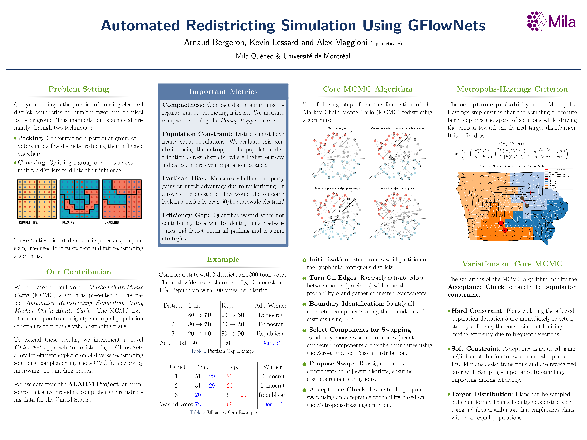
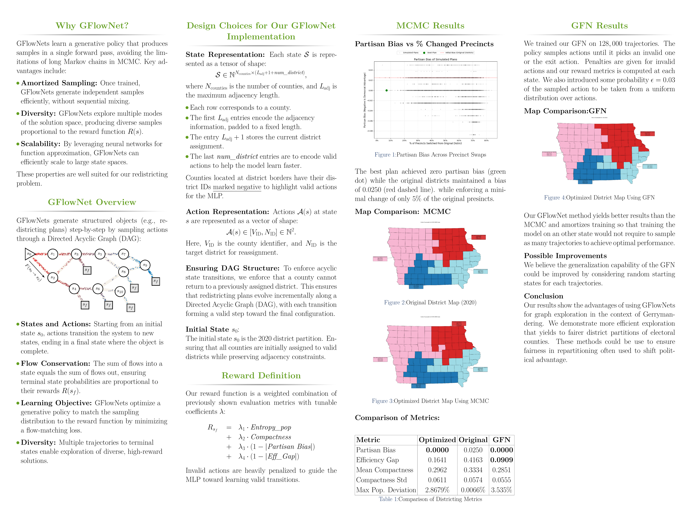

# Automatic Redistricting Using GFlowNets to Solve Gerrymandering

Gerrymandering is the practice of drawing electoral
district boundaries to unfairly favor one political
party or group.

We replicate the results of the _Markov chain Monte Carlo_
(MCMC) algorithms presented in the paper _Automated Redistricting Simulation Using Markov Chain Monte Carlo_. The MCMC algorithm incorporates contiguity and equal population constraints to produce valid districting plans.

To extend these results, we implement a novel _GFlowNet_ approach to redistricting. GFlowNets allow for efficient exploration of diverse redistricting solutions, complementing the MCMC framework by improving the sampling process.

# Sections

_Currently under construction_

- [Introduction](#introduction)
- [Problem](#problem)
- [Data](#data)
- [Methodology](#methodology)
- [Results](#results)
- [Conclusion](#conclusion)
- [References](#references)
- [Contributors](#contributors)
- [License](#license)

# Introduction

Gerrymandering is the practice of manipulating the boundaries of an electoral
constituency to favor one party or class. This project aims to reduce the impact
of gerrymandering by creating a automatic simulation tool that can be used to
draw fair and unbiased electoral districts.

# Problem

Current Markov Chain Monte Carlo implementations (Fifield 2020) are too
expensive to run on large states like Pennsylvania. Our automatic
redistricting tool will use Generative Flow Networks (GFNs) to generate a set
of possible district boundaries that are both contiguous and compact and
then "select" the most fair and unbiased redistricting plan based on specific
constraints.

Markov Chain Monte Carlo (MCMC) Sampling is inefficient, especially with the
parallel tempering for Markov Chains on the temperature of the Gibbs
distribution approximation.

Generative Flow Networks (GNFs) should solve this issue by providing a more
efficient and scalable approach to generating and evaluating potential
districting plans. Unlike MCMC methods, GFNs leverage directed acyclic graphs
(DAGs) to model the sequential generation process of district boundaries,
allowing for faster convergence and better handling of complex constraints
such as contiguity and compactness.

# Data

We use the following website to find the data for the congressional districts of any state in the US:
https://alarm-redist.org/fifty-states/PA_cd_2020/

We use the data or Pennsylvania like in the reference paper.

The data has been extracted and saved in json format using jsonlite in R.

# Methodology

## MCMC Sampling

Core algorithm:
- **Initialization**: Start from a valid partition of the graph into contiguous districts.

- **Turn On Edges**: Randomly activate edges between nodes (precincts) with a small probability \( q \) and gather connected components.

- **Boundary Identification**: Identify all connected components along the boundaries of districts using BFS.

- **Select Components for Swapping**: Randomly choose a subset of non-adjacent connected components along the boundaries using the Zero-truncated Poisson distribution.

- **Propose Swaps**: Reassign the chosen components to adjacent districts, ensuring districts remain contiguous.

- **Acceptance Check**: Evaluate the proposed swap using an acceptance probability based on the Metropolis-Hastings criterion.

The variations of the MCMC algorithm modify the **Acceptance Check** to handle the **population constraint**:

- **Hard Constraint**: Plans violating the allowed population deviation \( \delta \) are immediately rejected, strictly enforcing the constraint but limiting mixing efficiency due to frequent rejections.

- **Soft Constraint**: Acceptance is adjusted using a Gibbs distribution to favor near-valid plans. Invalid plans assist transitions and are reweighted later with Sampling-Importance Resampling, improving mixing efficiency.

- **Target Distribution**: Plans can be sampled either uniformly from all contiguous districts or using a Gibbs distribution that emphasizes plans with near-equal populations.

## Generative Flow Networks (GFNs)

- https://milayb.notion.site/The-GFlowNet-Tutorial-95434ef0e2d94c24aab90e69b30be9b3
- https://arxiv.org/abs/2111.09266

Torchgfn:

- https://github.com/Ben-Rapkin-Oberlin/gflownet_for_FS/blob/main/first_approach/env.py
- https://github.com/d-tiapkin/gflownet-rl/tree/main
- https://github.com/GFNOrg/torchgfn
- https://github.com/GFNOrg/torchgfn/tree/6f132a869902584c06b7f8054e76dda696d78c94

# Results

In the paper, they demonstrate that small changes in the district boundaries can
nearly eliminate partisan bias in the electoral outcome. They also show that
the proposed method can be used to generate a large number of redistricting
plans that are both contiguous and compact.

# Conclusion

# References

- [Automated Redistricting Simulation Using Markov Chain Monte Carlo](https://imai.fas.harvard.edu/research/files/redist.pdf)

# Contributors

- [Alex Maggioni](alex.maggioni@mila.quebec)
- [Arnaud Bergeron](arnaud.bergeron@mila.quebec)
- [Kevin Lessard](kevin.lessard@mila.quebec)

# License
